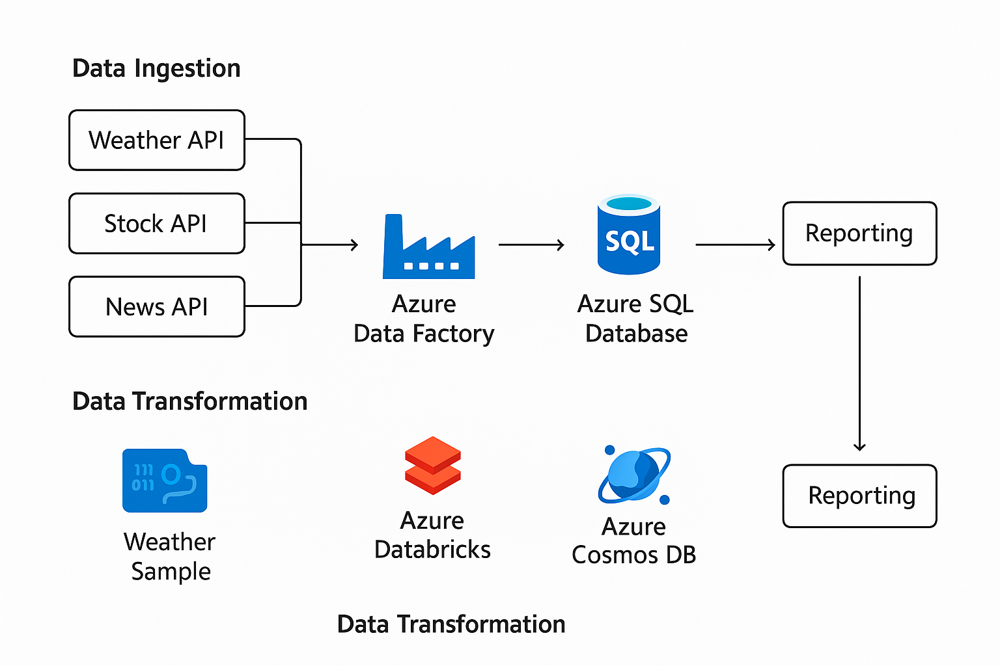

# End-to-End-Data-Engineering-Pipeline



## 📌 Overview
This project demonstrates a **production-grade Data Engineering pipeline** that ingests, transforms, validates, and stores data from multiple sources.  
It is designed with industry best practices, modular code, and scalability in mind.

---

## 🏗 Architecture
The pipeline consists of the following components:
1. **Data Ingestion** – Pulls data from APIs, databases, and files.
2. **Data Transformation** – Cleans, normalizes, and enriches datasets using Python & Pandas.
3. **Data Validation** – Ensures schema compliance and quality checks.
4. **Data Storage** – Saves processed data to a SQL database for analytics.
5. **Orchestration** – Managed using Apache Airflow for scheduling and dependencies.
6. **Visualization (Optional)** – Data insights with Tableau/Power BI.

---

## 📂 Project Structure
📦 data-engineering-pipeline
├── dags/ # Airflow DAGs
├── scripts/ # Python scripts for ETL tasks
├── data/ # Raw & processed data
├── logs/ # Pipeline logs
├── requirements.txt # Python dependencies
├── architecture_diagram.png
└── README.md

yaml
Copy
Edit

---

## ⚙️ Tech Stack
- **Language**: Python 3.10+
- **Libraries**: Pandas, Requests, SQLAlchemy
- **Orchestration**: Apache Airflow
- **Database**: MySQL/PostgreSQL
- **Version Control**: Git & GitHub
- **Deployment**: Docker

---

## 📊 Workflow
1. **Fetch Data** → API / CSV / Database
2. **Clean & Transform** → Handle missing values, type casting
3. **Validate Data** → Check duplicates, schema match
4. **Load into DB** → MySQL/PostgreSQL
5. **Schedule & Monitor** → Apache Airflow

---

## 🚀 How to Run Locally
1. Clone the repository:
   ```bash
   git clone https://github.com/<your-username>/data-engineering-pipeline.git
Install dependencies:

bash
Copy
Edit
pip install -r requirements.txt
Start Airflow (Docker example):

bash
Copy
Edit
docker-compose up -d
Trigger DAG via Airflow UI.

🗂 Example Use Cases
Real-time stock market pipelines

Weather data ingestion & alerts

IoT sensor data ETL workflows

📜 License
This project is open-source under the MIT License.

🤝 Contributing
Pull requests are welcome!
For major changes, please open an issue to discuss what you would like to change.

